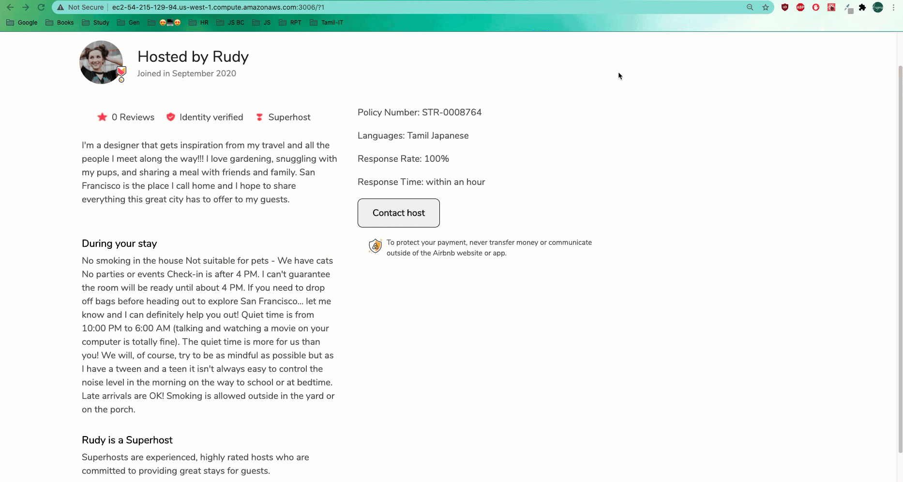

## FEC Project: AirBnB Product detail clone page
---


---
> Host profile service built based on MERN stack.

Runs the app in development mode.

Open [http://localhost:3006/?id](http://localhost:3006/?id) to view it in the browser.

---

### Related Projects

* https://github.com/FEC-Gai/images-service
* https://github.com/FEC-Gai/Check-In-Service
* https://github.com/FEC-Gai/HomeDescriptionService
* https://github.com/FEC-Gai/header-footer

---

### Installation

Requires Node 12.13.1^ & npm 6.12.1^ to run.

• Clone the repo
```
 $ git clone https://github.com/FEC-Gai/HostProfileService.git
```
• From within the root directory run,
```
 $ npm install
```
---

### Local development

First seed the db using,
```
$ npm run seed
```

To run  the server,
```
$ npm start
```

To build the client,
```
$ npm run build

or

$ npm run dev:build
```

To run the tests,
```
$ npm test
```

### Notes

Before seeding,
* If using mongo atlas, make sure the mongoUri in server/db/index.js is pointing to respective server with credentials updated in config file.


